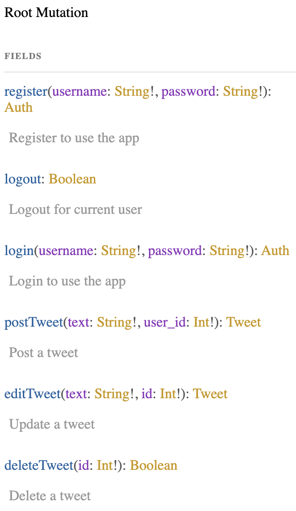
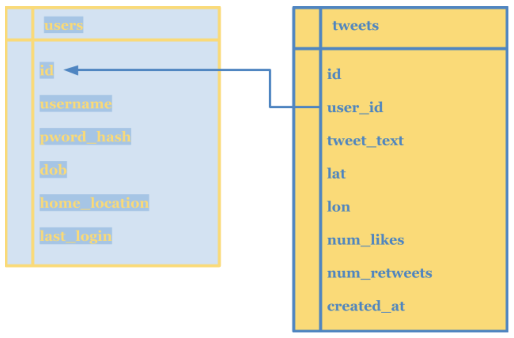

# Minimal Twitter GraphQL API

This project is a barebones GraphQL API for users to post and read messages. The API is designed to handle user authentication 1) to validate email and phone numbers and 2) to protect user accounts from other users trying to post/edit/delete messages linked to user. Data currently persists in-memory, with schema and connection to PostgreSQL database for future implementation. Interaction with this API can be done via graphiql. Enjoy!


#### > Functional Requirements
+ Creates a new user with password-protected login, and email or phone number as username
+ Validates username as email or phone number format (TODO: authenticate)
+ Encrypts backend storage of user passwords
+ Keeps users in session for a set period of time (max cookie age)
+ Allows existing users to log in with the same credentials provided upon registration
+ Posts messages linked to a user (must be authorized)
+ Allows users to edit their own messages
+ Allows users to delete their own messages
+ Retrieves all messages that a user has posted

#### > Performance Goals
+ High availability
+ Low latency
+ Consistency of data is less important (chosen tradeoff)

#### > Technical Specifications
+ Node.js
+ GraphQL
+ PostgreSQL (TODO)
+ Passport for authentication

<br>

### `Steps to Run`

First clone this repo. Then create an .env file with the following:

```
PORT=5000
NODE_ENV=development or production
SESSION_SECRET=secret
```

Run these commands to start the backend server:

`npm install`
`npm run start`

Visit [http://localhost:5000/graphql](http://localhost:5000/graphql).
This is the graphiql interface where you can run queries and mutations.
For example, try the following:

```graphql
query {
  users {
    id
    username
    tweets
  },
  tweets {
    id
    user { username }
    text
  }
}

mutation {
  register(username: 'your@email.com', password: 'password') {
    user {
      id
      username
    }
  },
  postTweet(text: '<Tweet here> because this view from my balcony cannot be beat', user_id: 4) {
    text
    user_id
  }
}
```

*NOTE: Because a user must be logged in to post a message associated with their account, and existing in-memory users do not have passwords saved (would be hashed), please first register, then log in, and note what your user.id is in order to post a tweet.*

<br>

## `Design`

This project is relatively straightforward in its design and simple in its implementation.
The primary backend components are: 1) Passport Authentication, 2) GraphQL Schema, and 3) PostgreSQL Schema.

### > Authentication
Using the Passport.js package, along with a local strategy built to integrate with GraphQL as opposed to REST APIs, all requests to authenticate are passed to the callback function `authenticateUser`, which does two things: checks if user is stored in database, and verifies the password matches the hashed password stored in database. When a user registers or logs in, a session is created and saved. All mutation requests use the `context` to check the existing session and/or authenticate the caller to ensure proper permissions before executing the requested operation.

### > API
The GraphQL API consists of a schema, types, queries, mutations, and resolvers. We have non-root-level types for UserType, TweetType, and AuthPayload.

Query endpoints are provided as:
+ Get user: user_id or username => info about user (UserType)
+ Get users: (no args) => list of users (List of UserType)
+ Get tweet: tweet_id => info about tweet (TweetType)
+ Get tweets: username or user_id (optional args) => list of tweets (List of TweetType)

Mutation endpoints are provided as:
+ Register: username, password => info about user (UserType), AuthPayload
+ Login: username, password => info about user (UserType), AuthPayload
+ Logout: (no args) => boolean to show operation successful
+ Post tweet: text, user_id => info about tweet (TweetType)
+ Update tweet: text, tweet_id => info about tweet (TweetType)
+ Delete tweet: tweet_id => boolean to show operation successful

### > GraphQL Schema
Here is the list of supported query and mutation fields as API endpoints:
<br>

<br>
<br>
<br>

<br>
<br>
<br>

### > Database Schema

The server establishes a connection to local PostgreSQL database; however, the data storage requirement is currently implemented in-memory with a series of db-utility functions emulating SQL queries.

A [seed](./model/seed.sql) file shows the planned database schema for users and tweets tables.


<br>


## Repo File Structure

    project
    ┣ graphql
    ┃ ┣ mutations.mjs
    ┃ ┣ queries.mjs
    ┃ ┣ resolvers.mjs
    ┃ ┣ schema.mjs
    ┃ ┗ types.mjs
    ┣ loaders
    ┃ ┣ authorization.mjs <passport configs>
    ┃ ┣ express.mjs
    ┃ ┣ postgres.mjs
    ┃ ┗ index.js <entry point>
    ┣ model
    ┃ ┣ db-utils.mjs
    ┃ ┣ data.mjs <mock data>
    ┃ ┗ seed.sql <seed data>
    ┗ server.mjs <server entry point>


## // TODO:
- write tests, improve error handling
- add actual persistence layer with repository pattern, SQL queries
- tracking user relationships and likes
- multimedia support, cache & local file storage
- subscriptions
